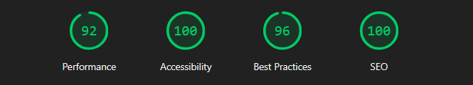

# NebulaOS — Futuristic Productivity Microsite


> _More than productivity. Absolute control. An interface with intelligence and soul._

---

## 🧭 About NebulaOS

**NebulaOS** is a **high-impact landing experience** for a fictional productivity OS — built as a portfolio piece to showcase motion, polish, and thoughtful UI systems.

Made for fluid visuals, intelligent control, and total adaptability:

- ✨ Framer Motion + GSAP choreography across sections
- ⚙️ Modular React/Vite architecture with a hidden **Dev Panel** (`Ctrl + Shift + D`)
- 🌗 Theme with system detection, local persistence, and reduced-motion support
- 🧪 Unit + E2E + a11y checks in CI (Vitest + Playwright + axe)
- ⚡ Performance budgets via Lighthouse CI (LHCI)

---

## 🚀 Live Preview

👉 https://nebulaos.quimromero.com/

---

## ✨ Features

- 🌓 **Light/Dark mode** with system preference + local persistence
- 🌀 **Respect reduced motion** for accessible animations
- ⚡ **Interactive console demo** with simulated AI responses and modal panel
- 🧩 **Modular UI** (fictional) with stackable components
- 🛠️ **Hidden Dev Mode** for tech details (`Ctrl + Shift + D`)
- 🗣️ **Testimonials carousel** for narrative tone
- ♿ **A11y-first details** (landmarks, ARIA on controls like Theme Toggle)
- 🧪 **Automated tests**: unit, E2E, and accessibility baked into CI

---

## 🧠 Tech Stack

| Tech                          | Role                              |
| ----------------------------- | --------------------------------- |
| **React + TypeScript + Vite** | Core app framework / bundler      |
| **Tailwind CSS**              | Design system & theming           |
| **Framer Motion + GSAP**      | Motion + micro-interactions       |
| **Vitest + Testing Library**  | Unit testing                      |
| **Playwright**                | E2E testing                       |
| **axe-core + vitest-axe**     | Accessibility checks (unit & E2E) |
| **ESLint + Prettier**         | Linting & formatting              |
| **Lighthouse CI (LHCI)**      | Performance & a11y budgets in CI  |

---

## 🗂 Project Structure

- `src/`
  - `components/` – Button, ThemeToggle, Header, Footer, DevPanel, Container
  - `sections/` – **Hero**, **WhatIs**, **Features**, **Demo**, **Testimonials**, **CTA**
  - `context/` – Theme context (persisted, system-aware)
  - `styles/` – Tailwind base and utilities
  - `tests/` – E2E specs (Playwright) + a11y helpers
- `public/` – Meta, icons, avatars, screenshots

---

## 🧪 End-to-End Testing

NebulaOS uses **Playwright** for E2E and **Vitest** for unit tests. CI runs on each push/PR via **GitHub Actions**.

**Currently tested**

- ✅ App loads with no console errors and shows hero headline
- ✅ **Theme toggle** switches classes (`light`/`dark`) and respects stored preference
- ✅ **A11y scan** (wcag2a/aa) on Home with `@axe-core/playwright`

**Coming soon**

- 🖱️ Console interactions + modal flows
- 🧭 Header nav and anchor routes
- ♿ Additional ARIA checks and keyboard traps

🧪 **CI status:** https://github.com/quim-romero/nebulaos/actions

---

## ♿ Accessibility & ⚡ Performance

**Accessibility**

- Unit a11y with **vitest-axe**; browser a11y with **@axe-core/playwright** in CI.  
  _Goal: 0 violations on core flows._

**Performance**

- Lighthouse (LHCI) asserts budgets on the built site.  
  _Goal: keep FCP/LCP in the green on the homepage._



**Run locally (essentials)**

```bash
# Dev
npm run dev

# Unit tests
npm run test:unit

# Unit a11y subset
npm run a11y:unit

# E2E (headless)
npm run test:e2e

# Quick smoke / a11y E2E
npm run smoke
npm run a11y:e2e

# Build + Lighthouse CI (filesystem reports)
npm run build && npm run lhci:fs
```

---

## 📸 Screenshots

| Hero                            | Features                                | Demo                            |
| ------------------------------- | --------------------------------------- | ------------------------------- |
|  |  |  |

---

## 🧩 Notes

- 🧠 100% hand-coded — no templates
- 🧼 Prioritizes clarity, motion feel, and accessibility
- 🛠 Built as a **developer portfolio project**, not a production SaaS

---

## 📬 Contact

If you’re looking for a frontend developer who builds **clean, animated, accessible** interfaces:

- 📧 quim@quimromero.com
- 🌐 https://www.quimromero.com/

---

> _NebulaOS turns productivity into a living experience — where design, interaction, and code flow together._
