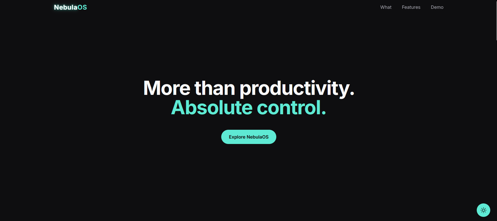
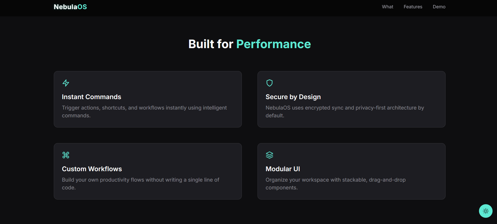
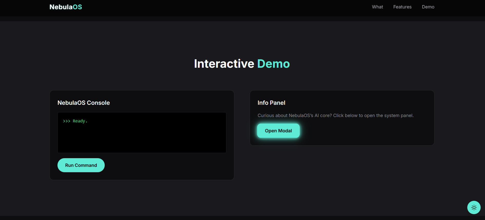

# NebulaOS — Futuristic Productivity Microsite

> _More than productivity. Absolute control. An interface with intelligence and soul._

---

## 🧭 About NebulaOS

**NebulaOS** is an **interactive landing page** designed to launch a fictional product that redefines modern productivity. Built as a portfolio project, it blends advanced animation, modular components, and an immersive thematic experience.

Focused on visual fluidity, intelligent control, and total adaptability:

- ⚙️ Modular React/Vite architecture with hidden DevPanel
- 🌙 Dark/light mode with persistent user preference
- ✨ Animated transitions using Framer Motion + GSAP
- 🧠 Simulated interactive console and modal panels
- 📐 Fully responsive and performance-optimized layout

---

## 🚀 Live Preview

👉 [https://nebulaos.quimromero.com/](https://nebulaos.quimromero.com/)

---

## ✨ Features

- 🌓 Dark/light theme toggle (auto-detects system preference)
- 🔐 Privacy-first and secure architecture
- ⚡ Simulated instant commands via a "console"
- 🧩 Modular drag & drop-based (fictional) component UI
- 🛠️ Hidden Dev Mode (`Ctrl + Shift + D`) with technical info
- 🗣️ Dynamic testimonials for storytelling
- 🧪 Automated E2E testing via GitHub Actions

---

## 🧠 Tech Stack

| Tech                                      | Role                                   |
| ----------------------------------------- | -------------------------------------- |
| **React + Vite**                          | Framework and bundler                  |
| **Framer Motion + GSAP**                  | Advanced animations                    |
| **Tailwind CSS**                          | Utility-first styling                  |
| **Vitest + Testing Library + Playwright** | Full-spectrum testing                  |
| **React Helmet**                          | Dynamic SEO and metadata               |
| **GitHub Actions**                        | Continuous integration for E2E testing |

---

## 🗂 Project Structure

- `src/`
  - `components/` – Buttons, Theme Toggle, Dev Panel, etc.
  - `sections/` – Hero, About, Features, Demo, Testimonials, CTA
  - `context/` – Global theme context
  - `styles/` – Tailwind global styles
  - `test/` – Test setup
- `public/` – Avatars, icons, and assets

---

## 🧪 End-to-End Testing

NebulaOS uses **Vitest** for unit testing and **GitHub Actions** for automated testing on push/PR.

Currently covered:

- ✅ App renders without errors
- ✅ Snapshot test for `Button`
- ✅ CI setup for E2E testing

Coming soon:

- 🧪 Interaction tests for console and modal
- 🌙 Theme persistence tests
- 🔍 Accessibility validation for navigation

🧪 [View CI status →](https://github.com/quim-romero/nebulaos/actions)

---

## 📸 Screenshots

| Hero                            | Features                                | Demo                            |
| ------------------------------- | --------------------------------------- | ------------------------------- |
|  |  |  |

---

## 🧩 Notes

- ✨ 100% handcrafted UI — no templates used
- 🔍 Inspired by emotional, clear, and modern design
- 🧪 Perfect to showcase advanced frontend interaction skills

---

## 📬 Contact

Looking for a frontend developer with visual sensitivity and technical precision?

- 📧 quim@quimromero.com
- 🌐 [https://www.quimromero.com/](https://www.quimromero.com/)

---

> _NebulaOS transforms the idea of productivity into a living experience —  
> where design, interaction, and code flow together._
